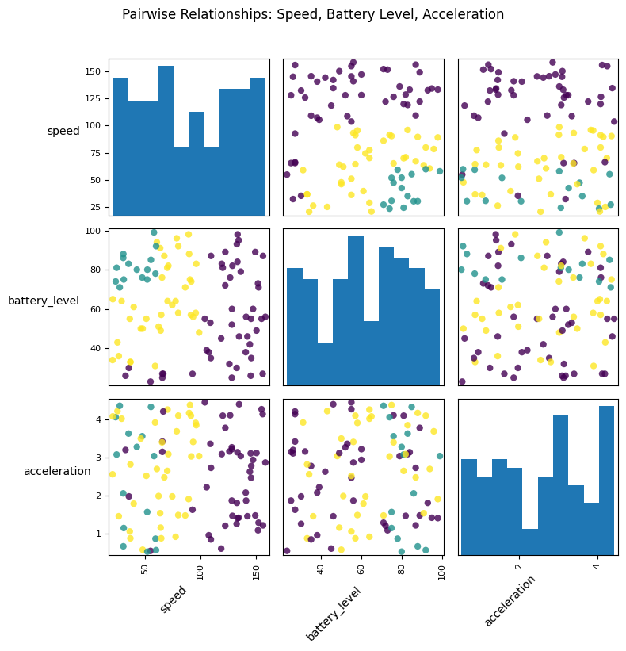

# 🚗 Hybrid Vehicle Mode Switcher

A **Python-based hybrid vehicle simulation and analytics system** that demonstrates how modern hybrid vehicles dynamically switch between **Electric Mode, Hybrid Mode, and Engine Mode** using vehicle parameters such as **speed, battery level, and acceleration**.

The system combines **simulation, machine learning prediction, backend APIs, and visualization dashboards** to analyze vehicle performance and energy efficiency.

---

# 📌 Project Overview

Hybrid vehicles use a combination of **electric motors and internal combustion engines** to optimize fuel efficiency and reduce emissions.

This project simulates a **hybrid vehicle energy management system** that:

* Monitors real-time vehicle parameters
* Predicts optimal driving mode
* Stores vehicle records in a database
* Generates analytics dashboards

The system integrates:

⚙️ Backend simulation engine
📊 Machine learning prediction
🗄️ Database storage for vehicle records
📈 Visualization dashboards for performance analysis

---

# ⚙️ Key Features

✔ Intelligent switching between **Electric, Hybrid, and Engine modes**
✔ Simulation of realistic driving conditions
✔ Machine learning model for **mode prediction (~95% accuracy)**
✔ Real-time vehicle data recording
✔ Backend API for analytics and visualization
✔ Interactive charts for system analysis
✔ Data storage using **SQLite database**

---

# 🧠 System Architecture

```
User Interface (Web Dashboard)
        ↓
Frontend (HTML / CSS / JS)
        ↓
Flask Backend API
        ↓
Simulation Engine
        ↓
SQLite Database
        ↓
Analytics & Visualization
```

---

# 🛠️ Tech Stack

## Backend

* Python
* Flask
* SQLite

## Frontend

* HTML
* CSS
* JavaScript

## Data Analysis

* Pandas
* NumPy
* Scikit-learn

## Visualization

* Matplotlib
* Seaborn
* Chart.js

---

# 🧠 Simulation Logic

The **simulation engine** generates realistic driving scenarios including:

* Speed variations
* Acceleration changes
* Battery drain

The optimal vehicle mode is determined using rule-based logic:

**Electric Mode**

* High battery level
* Low speed

**Hybrid Mode**

* Medium battery level
* Moderate speed

**Engine Mode**

* Low battery level
* High speed

The simulator calculates:

* energy consumption
* efficiency score
* distance travelled
* battery usage

---

# 📊 Machine Learning Model

The project includes a **Random Forest classifier** trained on simulated driving data.

### Model Inputs

* Speed (km/h)
* Battery Level (%)
* Acceleration (m/s²)

### Model Output

Predicted vehicle mode:

* Electric
* Hybrid
* Engine

### Model Performance

Accuracy achieved: **~95%**

---

# 📸 Project Visualizations

## Speed, Battery Level & Acceleration Comparison


---

## Machine Learning Confusion Matrix


---

## Feature Relationship Analysis



---

## Driving Mode Distribution


# 🗄️ Database Design

Vehicle simulation records are stored in an **SQLite database**.

Each record contains:

* timestamp
* battery level
* speed
* acceleration
* vehicle mode
* efficiency score

The database supports analytics queries such as:

* mode frequency analysis
* efficiency by driving mode
* battery usage patterns
* speed category analysis

---

# 📁 Project Structure

```
Hybrid-Vehicle-Mode-Switcher
│
├── backend
│   ├── app.py
│   └── simulation_engine.py
│
├── frontend
│   ├── static
│   └── templates
│
├── assets
│   ├── database_setup.sql
│   └── hybrid_vehicle.db
│
├── images
│   ├── comparison_plot.png
│   ├── confusion_matrix.png
│   ├── pairplot.png
│   └── mode_distribution.png
│
├── requirements.txt
└── README.md
```

---

# 🚀 Setup Instructions

### 1️⃣ Clone the repository

```
git clone https://github.com/sohamgulhane13/hybrid-vehicle-mode-switcher.git
cd hybrid-vehicle-mode-switcher
```

---

### 2️⃣ Install dependencies

```
pip install -r requirements.txt
```

---

### 3️⃣ Run the backend server

```
python app.py
```

---

### 4️⃣ Open the application

Open your browser and go to:

```
http://localhost:5000
```

---

# 🎯 Learning Outcomes

This project demonstrates practical knowledge of:

* Hybrid vehicle powertrain systems
* Backend development using Flask
* Simulation-based system modeling
* Machine learning for decision systems
* Database-driven analytics
* Data visualization for engineering analysis

---

# 🔮 Future Improvements

Possible extensions include:

* Integration with **real CAN-bus vehicle data**
* Deployment on **embedded automotive hardware**
* Reinforcement learning for **adaptive driving optimization**
* Real-time vehicle telemetry dashboards

---

# 👨‍💻 Team Members

* Manas Kotian
* Sujit Nirmal
* Soham Gulhane
* Aadesh Khamkar

Guide: **Prof. Usha Jadhav**

---

# ⭐ Support

If you found this project useful, consider **starring the repository ⭐**

---

✅ After adding this README, your repo will look **much more professional for recruiters reviewing your resume**.

---

If you want, I can also help you create a **very strong README for your ESC Stability Control Simulator project**, which will make your **GitHub portfolio look like a real automotive engineering portfolio.**
